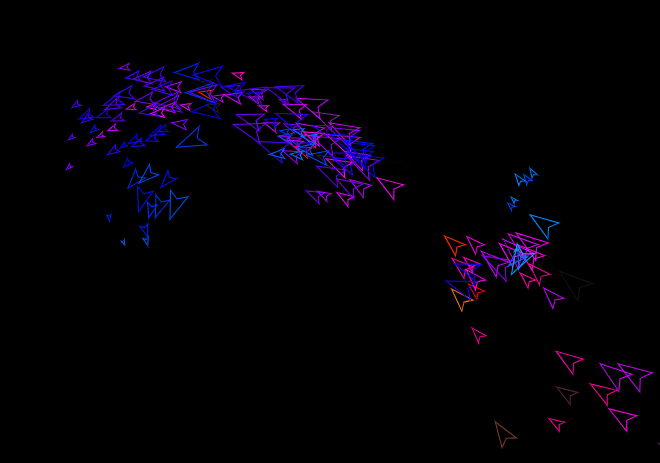

# Boids Flocking Simulation

## Introduction 

This is a naive p5.js implementation of the "Boids" flocking algorithm described by Craig Reynolds in 1987:

[Flocks, Herds, and Schools: A Distributed Behavioral Model – Reynolds, C.W. [Computer Graphics 21(4), July 1987]](http://www.cs.toronto.edu/~dt/siggraph97-course/cwr87/#ref4)

This version has been stripped down for sharing, but it was a component of a larger visualisation assignment. Some vestiges might remain.

If you are interested in more interesting variations like Perlin noise, predators and beat mapping, please [email me](https://github.com/gstarch). 

## What is a boid?

A boid is an artificial agent that moves on a 2D canvas and detects other boids that are nearby. The boid is influenced by the balance of three behaviours:
- **Alignment:** Boids like to steer in the average direction of their close neighbours.
- **Cohesion:** Boids like to adjust their velocity to match nearby boids.
- **Separation:** Boids need a bit of space and will steer away from boids that crowd them.

In addition, a centre-seeking force is applied when boids approach canvas boundaries. An alternative solution is to wrap around to the other side of the screen (as seen in the Daniel Shiffman version).

## Acknowledgements

- Craig Reynolds ([wikipedia](https://en.wikipedia.org/wiki/Craig_Reynolds_(computer_graphics)) | [github](https://github.com/cwreynolds)) for being the mind behind the core flocking behaviour algorithm known as [Boids](https://en.wikipedia.org/wiki/Boids).
- Daniel Shiffman([wikipedia](https://en.wikipedia.org/wiki/Daniel_Shiffman) | [github](https://github.com/shiffman)) for his incredible enthusiasm and ability to inspire creative coders everywhere. Visit [The Coding Train](https://thecodingtrain.com/) to see more of his amazing materials and tutorials. He also created a [Boids example](https://p5js.org/examples/simulate-flocking.html) for the p5.js project which helped me a lot.

## Further Reading and References

### Books

- Braitenberg, V. (1984). Vehicles: Experiments in Synthetic Psychology. MIT Press.

- Bourg, D.M. & Bywalec, B. (2013). Physics for Game Developers. O'Reilly.

- Shiffman, D. (2012). The Nature of Code. The Coding Train.

- Vince, J. (2001). Mathematics for Computer Graphics. Springer.

### Articles

- Reynolds, C.W. (1987). "Flocks, Herds, and Schools: A Distributed Behavioral Model". Computer Graphics, 21(4), July. [Online]. Available at: http://www.cs.toronto.edu/~dt/siggraph97-course/cwr87/#ref4

- Roberts, S. (2020). "The Lasting Lessons of John Conway’s Game of Life". New York Times. [Online]. Available at: https://www.nytimes.com/2020/12/28/science/math-conway-game-of-life.html

- WIRED. (2019). "Starlings Fly in Flocks So Dense They Look Like Sculptures". [Online]. Available at: https://www.wired.com/story/starlings-murmurations/
